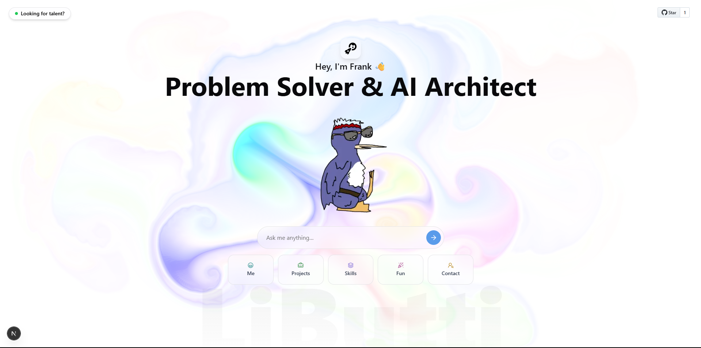

# Francis J. LiButti's Dynamic AI Portfolio 🤖✨

**Why just read a resume when you can *converse* with my experience?** Traditional portfolios are static.
That's why I've leveraged an innovative template to build my dynamic AI portfolio.

This isn't just a website; it's a direct channel to my strategic thinking, data analysis skills, and passion for AI innovation.
Instead of endless scrolling, my AI persona adapts to *your* curiosity. Just ask a question — and get instant, tailored insights into my projects and expertise.

## 👇 What can you ask?

- 🧠 **Tech Recruiter?** Ask about my data-driven impact & AI project results (like CareerSuite.AI!).
- 💻 **Potential Client/Collaborator?** Dive into how I streamline operations & secure high-value outcomes.
- 💡 **Fellow Innovator?** Explore my journey in full-spectrum problem-solving, from AgTech validation (NSF I-Corps) to robotic leadership (HAV Project).

---

This isn't just a portfolio; it’s a **dynamic conversation, shaped by your specific interests**.

➡️ **Try it now:** https://francisjbutti.vercel.app/
*What will you ask?*

---

## 🙏 Acknowledging the Innovation

This interactive experience is built upon the ingenious AI portfolio template originally developed by **Raphaël Giraud** ([https://toukoum.fr](https://toukoum.fr)). His vision of an AI-powered, conversational portfolio perfectly aligned with my goal of showcasing my unique blend of strategic, data, and AI capabilities in an engaging new way. A huge thank you to Raphaël for pioneering this innovative approach!

#### 🔖 Tags

`#AIPortfolio` `#DataAnalytics` `#StrategicProjectManagement` `#AIInnovation` `#TechLeadership` `#ScalableSolutions` `#DigitalTransformation`
